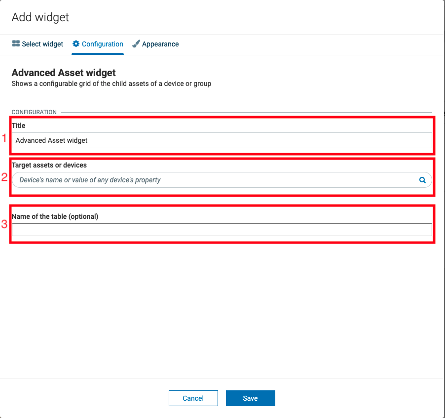

# Advanced Asset Widget for Cumulocity IoT platform


This project contains the advanced asset widget. It is a custom widget, which is build upon the c8y-data-grid.
## Overview
The target of this repository is to provide an example implementation of the **c8y-data-grid** - in this case by wrapping it into a widget. The implementation of the grid is very basic and rudimentary and shall act as a blueprint/ starting point for your own table widget.

You can find a customized cockpit app under the `cockpit-app` folder. It's really just the plain cockpit app with a `widgets` folder containing the advanced-assets-widget. The folder `runtime-widget-template` contains the same widget ready to be deployed via application builder.

## Development

If you want to run locally you can use the cockpit-app folder.
1. Install the dependencies:
```
$ cd cockpit-app
$ npm i
```
2. Start up against the tenant of your choice

```
$ npm run start -u https://your.tenant.com/
```
## Deployment

You have two options:
1. You can **deploy the cockpit app** onto your tenant using:
```
$ cd cockpit-app
$ npm i
$ npm run build
$ npm run deploy
```
> Make sure to change the target tenant in the package.json!

2. You can go the **runtime widget loader** route:

If you intend to use the presales *application builder tool* with its widget upload wizard, you can follow the steps in the readme under the runtime-widget-template folder.

Since the widget code exists on 2 places, please make sure to keep both places up-to-date When doing changes on the widget.

1. Copy the contents from runtime-widget-template/src/advanced-asset-widget to demo/src/widget/advanced-asset-widget or vice versa

2. In the advanced-asset-widget.module.ts comment out import 'some-module/styles.css'

## Feel the power of c8y-data-grid!
Just create a fork and get your hands on the awesome and  feature rich c8y-data-grid.
The grid is continuously maintained and improved by the Cumulocity RnD team and already offers built-in:
- pagination
- lazy loading
- filtering
- sortation
- mobile layout
- actions per row
- bulk actions

 
### What can I find here? 
In the current implementation, the grid component is implemented as if a big dataset was expected. In order to improve the performance, it is using **pagination** and performing **filtration** and **sortation** on the cloud-site. This means pagination is enabled and the grid component is connected to a service which acts as a datasource. The provided example is very basic - only the natively supported filtration on strings is possible at the moment.

### Datasource
In principle the datasource needs to do 3 queries:
* count all entries if no filtration is done
* count all entries if current filtration is applied
* return resultset of the current query (containign the actual data and pagination info)

If the user now would set a filter for example on the name column of the grid, the *onDataSourceModifier* method would get invoked on the datasource. Our task is then to create a query based upon the filter and sortation settings the user has set - this is done in the *createQueryFilter* method.

The *fetchCount* methods basically work by setting the pageSize to exactly one so that one page would always contain just one element. If the responses pagination info would then contain 36 totalPages, we would know that there are exactly 36 devices matching our filter criteria. Unfortunately there is no other way to retrieve the exact count - with a larger pageSize we would not know how many elements the last page would contain. Keep in mind though that such requests are very expensive!

### Widget Configuration dialog



The configuration currently only contains 3 fields:

* Title
* Group/ Device selection
* Table name input

**Title**
The title is added by default, nor did we add neither can we remove that.

**Group/ Device selection**
The group/ device selection was added by setting *groupsSelectable: true* in the *advanced-asset-widget.module.ts*. Since this selection currently still is written in AngularJS, you can only see it when adding the widget to a hybrid project such as the cockpit app. On a native Angular app you would not see the group selector during development, but as soon as you'd deploy the widget to the tenant.

**Table name input**
The table name input can be found in the *advanced-asset-widget-config.component.ts*. 

**Extending the configuration** 
You can easily add more inputs - just add them to the HTML markdown in the *advanced-asset-widget-config.component.ts*. The important part is to bind the output of these inputs to the config property so that it can be accessed from the other parts of the widget. 

The *onBeforeSave* method currently always returns true. If you for example add required fields, make sure to add some validation logics there. I added the return type intentionally - as you can see it is also possible to return boolean Promises or Observables, meaning if you need to do a query in order to validate, this is possible, too!

### Customize your table!

**Column Layout**
Feel free to temper with the layout of the columns of the grid, either by defining **your own content projection** inside the *advanced-asset-widget.component.html*.

I already did it for the **id** and **lastUpdated** columns:

    <c8y-data-grid ...>
	    ...
	    <c8y-column name="id">
		    <ng-container *c8yCellRendererDef="let context">
			    <a [routerLink]="['/device', context.value]">{{ context.value }}</a>
			</ng-container>
		</c8y-column>
		<c8y-column name="lastUpdated">
			<ng-container *c8yCellRendererDef="let context">
				{{ context.value | date: "dd MMM yyyy, HH:mm:ss" }}
			</ng-container>
		</c8y-column>
		...
	</c8y-data-grid>
The name of the c8y-column needs to match the value of the name attribute of the column you want to customize.

Or you can change the columns behavior and style by creating **your own cell renderer components**. Just create a new component and add that to the column configuration in *getDefaultColumns* by using the *cellRendererComponent* property. Make sure to add the render component as entry component in the *advanced-assets-widget.module.ts*.

------------------------------
These tools are provided as-is and without warranty or support. They do not constitute part of the Software AG product suite. Users are free to use, fork and modify them, subject to the license agreement. While Software AG welcomes contributions, we cannot guarantee to include every contribution in the master project.
_____________________
For more information you can Ask a Question in the [TECHcommunity Forums](http://tech.forums.softwareag.com/techjforum/forums/list.page?product=cumulocity).
You can find additional information in the [Software AG TECHcommunity](http://techcommunity.softwareag.com/home/-/product/name/cumulocity).
